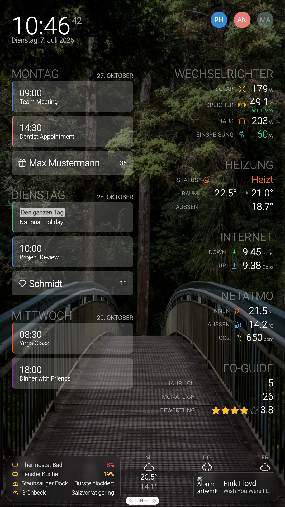

<div align="center">

# 🖥️ Dashboard

**A self-hosted, single-container information dashboard for an always-on screen.**

Weather · calendars · public transport · household presence · climate · solar —
in one server-rendered view, with a rotating photo background and event-driven
corner overlays.

[](https://nuxt.com)
[](https://vuejs.org)
[](https://hub.docker.com/r/philippspinnler/dashboard)

<br>



<sub>Portrait orientation, running in mock mode — all widgets and overlays shown with placeholder data.</sub>

</div>

> [!TIP]
> Everything is configured at **runtime** through environment variables — the same
> Docker image runs anywhere without a rebuild. Want to try it with zero setup?
> Jump to [Mock mode](#-mock-mode).

---

## 📑 Table of Contents

- [✨ Features](#-features)
- [🧱 Architecture](#-architecture)
- [✅ Prerequisites](#-prerequisites)
- [🚀 Quick start](#-quick-start)
- [🛠️ Development](#️-development)
- [📦 Build & run](#-build--run)
- [🐳 Docker](#-docker)
- [⚙️ Configuration](#️-configuration)
  - [How it works](#how-it-works)
  - [Layout & global](#layout--global)
  - [Home Assistant (shared)](#home-assistant-shared)
  - [Widget reference](#widget-reference)
  - [Overlay reference](#overlay-reference)
  - [Photo background](#photo-background)
- [🧪 Mock mode](#-mock-mode)
- [🗂️ Project structure](#️-project-structure)

---

## ✨ Features

### Widgets

Placed into five screen regions (see [Layout & global](#layout--global)).

| Widget | id | Shows | Backed by |
| --- | --- | --- | --- |
| 🕐 Clock | `clock` | Time and date | — |
| 🌤️ Weather | `weather` | Current conditions + forecast | OpenWeatherMap |
| 📅 Calendar | `calendar` | Upcoming events | iCal feeds |
| 🚆 Public transport | `public-transportation` | Next departures | Transport API |
| 🌐 Internet | `internet` | Download / upload / ping | Speedtest |
| 🏠 Presence | `presence` | Who's home | Home Assistant |
| 🌡️ Netatmo | `netatmo` | Indoor/outdoor temp & CO₂ | Home Assistant |
| 🚗 Cars | `cars` | EV range, charge & status | Home Assistant |
| ☀️ Inverter | `inverter` | Solar PV, grid, battery flow | Home Assistant |
| 🔥 Heizung | `heizung` | Heat-pump state & temps | Home Assistant |
| 📈 eo-guide | `eo-guide` | App store metrics | AppFigures |

### Overlays

Not part of the grid — they appear over the background only when relevant.

| Overlay | Appears when… |
| --- | --- |
| 🎵 **Sonos now-playing** | a speaker is playing |
| 🔔 **Doorbell** | the doorbell is pressed (live camera feed) |
| ⚠️ **Warnings** | a battery is low, a device reports a problem, or a watched sensor leaves its healthy state |

### Ambient

🖼️ **Photo background** — a slowly rotating slideshow from an Immich or iCloud
shared album.

---

## 🧱 Architecture

| Layer | What |
| --- | --- |
| **UI** | Server-rendered Nuxt. Widget components in `components/widgets/`, arranged into regions by `app.vue`; overlays in `components/`. |
| **API** | One [Nitro](https://nitro.build) route per data source in `server/api/`, responses cached via `defineCachedEventHandler`. Same-origin, so no CORS and **secrets never reach the browser**. |
| **Config** | Every setting lives in `runtimeConfig` (`nuxt.config.ts`), overridable at container start via `NUXT_*` / `NUXT_PUBLIC_*`. Nothing is baked into the image. |

---

## ✅ Prerequisites

The dashboard runs anywhere with **Node.js 20+** (local dev/build) or just
**Docker** (deployment). Every integration below is **optional** — nothing is
required to *start* the app, and you can run the whole thing with no external
services at all via [Mock mode](#-mock-mode).

| For | You need | Used by |
| --- | --- | --- |
| 💻 Running locally | Node.js 20+ and npm | dev / build |
| 🐳 Running as a container | Docker | deployment |
| 🏠 Home-automation widgets & all overlays | A **[Home Assistant](https://www.home-assistant.io)** instance + a [long-lived access token](https://www.home-assistant.io/docs/authentication/#your-account-profile), reachable from the dashboard | presence, netatmo, cars, inverter, heizung, Sonos, doorbell, warnings |
| 🌤️ Weather | An [OpenWeatherMap](https://openweathermap.org/api) API key (One Call 3.0) | weather |
| 📅 Calendar | One or more iCal (`.ics`) URLs | calendar |
| 🖼️ Photo background | An [Immich](https://immich.app) server **or** an iCloud shared album | background |
| 📈 eo-guide | An [AppFigures](https://appfigures.com) account | eo-guide |

> [!NOTE]
> **Home Assistant is the backbone** for the home-automation widgets and all three
> overlays. Without it, just leave those widgets out of your layout — the rest
> (clock, weather, calendar, transport, internet, photo background) work
> independently.

---

## 🚀 Quick start

```bash
npm install

# offline — built-in mock data, no external services needed
NUXT_PUBLIC_USE_MOCK_DATA=true npm run dev
```

Open <http://localhost:3000>. To run against real services, copy
[`.env.example`](./.env.example) to `.env`, fill it in, then run `npm run dev`.

---

## 🛠️ Development

```bash
npm install
npm run dev          # http://localhost:3000
```

> [!IMPORTANT]
> The `dev` script sets `TMPDIR=/tmp`. macOS's default `$TMPDIR` is long enough to
> push Nuxt's vite-node unix socket path past the 104-char limit, which breaks
> `nuxt dev` (*"Failed to restrict vite-node socket permissions"*). `/tmp` is short.

---

## 📦 Build & run

```bash
npm run build
node .output/server/index.mjs        # serves on :3000
```

---

## 🐳 Docker

A multi-stage `Dockerfile` produces a small runtime image. On every push to
`main`, GitHub Actions builds and publishes it to Docker Hub as
[`philippspinnler/dashboard`](https://hub.docker.com/r/philippspinnler/dashboard)
(`latest` plus a commit-sha tag).

```bash
# run the published image
docker run -p 3000:3000 --env-file .env philippspinnler/dashboard

# or build locally
docker build -t dashboard .
docker run -p 3000:3000 --env-file .env dashboard
```

Because config is read at runtime, the same image runs anywhere — set the `NUXT_*`
env vars without rebuilding.

---

## ⚙️ Configuration

### How it works

- All settings are environment variables, applied at **runtime** (container start,
  or `.env` for local dev). Copy [`.env.example`](./.env.example) to get started.
- 🌐 **`NUXT_PUBLIC_*`** values are exposed to the browser (layout, toggles,
  positions). 🔒 **`NUXT_*`** (without `PUBLIC`) are server-only — keep API keys
  and tokens here; they never leave the server.
- Anything unset falls back to its default. A widget whose backing service isn't
  configured simply shows empty/zero values instead of failing.
- Most integrations read from **Home Assistant** — configure it
  [once](#home-assistant-shared) and reference your entity ids per widget.

### Layout & global

Widgets go into five regions via comma-separated id lists; order = display order.

| Variable | Default | Description |
| --- | --- | --- |
| `NUXT_PUBLIC_WIDGETS_TOP_LEFT` | `clock` | Top-left region |
| `NUXT_PUBLIC_WIDGETS_TOP_RIGHT` | _(empty)_ | Top-right region |
| `NUXT_PUBLIC_WIDGETS_LEFT` | `calendar` | Left column |
| `NUXT_PUBLIC_WIDGETS_RIGHT` | `heizung,presence,internet,netatmo,public-transportation,eo-guide` | Right column |
| `NUXT_PUBLIC_WIDGETS_BOTTOM` | `weather` | Bottom region |
| `NUXT_PUBLIC_ENABLE_GLASSMORPHISM` | `false` | Frosted-glass card styling |
| `NUXT_PUBLIC_USE_MOCK_DATA` | `false` | Serve mock payloads (see [Mock mode](#-mock-mode)) |
| `NUXT_TIMEZONE` | `UTC` | IANA timezone for date math, e.g. `Europe/Zurich` |

**Valid widget ids:** `clock`, `calendar`, `presence`, `internet`, `netatmo`,
`public-transportation`, `eo-guide`, `weather`, `cars`, `inverter`, `heizung`.

### Home Assistant (shared)

Presence, Netatmo, cars, inverter, heizung, and all three overlays read from Home
Assistant via its REST API. Create a [long-lived access
token](https://www.home-assistant.io/docs/authentication/#your-account-profile)
and set:

| Variable | Description |
| --- | --- |
| `NUXT_HOME_ASSISTANT_URL` | Base URL, e.g. `http://homeassistant.local:8123` |
| `NUXT_HOME_ASSISTANT_TOKEN` | 🔒 Long-lived access token |
| `NUXT_HOME_ASSISTANT_PERSON_ENTITIES` | Comma-separated `person.*` ids (presence widget) |

### Widget reference

<details>
<summary><strong>🕐 Clock</strong></summary>

No configuration. Uses `NUXT_TIMEZONE` for the displayed time.

</details>

<details>
<summary><strong>🌤️ Weather</strong> — OpenWeatherMap One Call 3.0</summary>

| Variable | Description |
| --- | --- |
| `NUXT_WEATHER_API_KEY` | 🔒 OpenWeatherMap API key |
| `NUXT_WEATHER_DEFAULT_LAT` | Latitude (decimal degrees) |
| `NUXT_WEATHER_DEFAULT_LON` | Longitude (decimal degrees) |

</details>

<details>
<summary><strong>📅 Calendar</strong> — iCal feeds</summary>

| Variable | Description |
| --- | --- |
| `NUXT_CALENDARS_JSON` | JSON array of `{ "name", "color", "icalUrl" }` |

```jsonc
NUXT_CALENDARS_JSON=[{"name":"Family","color":"#3788d8","icalUrl":"https://example.com/family.ics"}]
```

</details>

<details>
<summary><strong>🚆 Public transportation</strong></summary>

| Variable | Description |
| --- | --- |
| `NUXT_TRANSPORT_CONNECTIONS_JSON` | JSON array of `[from, to, "direct"]` triples |

```jsonc
NUXT_TRANSPORT_CONNECTIONS_JSON=[["Station A","Station B","direct"]]
```

</details>

<details>
<summary><strong>🌐 Internet / speedtest</strong></summary>

| Variable | Description |
| --- | --- |
| `NUXT_SPEEDTESTS_JSON` | JSON array of `{ "host", "port", "provider" }` |
| `NUXT_SPEEDTEST_SOURCE` | `speedtest-tracker` (default) or `iperf` — how each host's `/api/speedtest/latest` is parsed |

With `iperf`, point the hosts at a self-hosted iperf3 collector (runs `iperf3` against a
public server and serves the latest download/upload over HTTP) instead of a
[speedtest-tracker](https://github.com/linuxserver/docker-speedtest-tracker) instance.

</details>

<details>
<summary><strong>🏠 Presence</strong> — Home Assistant</summary>

Requires [Home Assistant](#home-assistant-shared). Configure who's tracked via
`NUXT_HOME_ASSISTANT_PERSON_ENTITIES`.

</details>

<details>
<summary><strong>🌡️ Netatmo</strong> — Home Assistant</summary>

| Variable | Description |
| --- | --- |
| `NUXT_NETATMO_INDOOR_TEMPERATURE_ENTITY` | Indoor temperature sensor |
| `NUXT_NETATMO_INDOOR_CO2_ENTITY` | Indoor CO₂ sensor |
| `NUXT_NETATMO_OUTDOOR_TEMPERATURE_ENTITY` | Outdoor temperature sensor |

</details>

<details>
<summary><strong>🚗 Cars</strong> — Home Assistant</summary>

| Variable | Description |
| --- | --- |
| `NUXT_CARS_JSON` | JSON array of car objects (entity ids per car; empty array if none) |

```jsonc
NUXT_CARS_JSON=[{
  "name":"Car",
  "range_entity":"sensor.car_range",
  "state_of_charge_entity":"sensor.car_battery",
  "charging_active_entity":"binary_sensor.car_charging",
  "charging_power_entity":"sensor.car_charging_power",
  "end_of_charge_entity":"sensor.car_charge_end_time"
}]
```

</details>

<details>
<summary><strong>☀️ Inverter</strong> — Home Assistant</summary>

The widget expects power in **watts**; if your entities report kW, set
`NUXT_INVERTER_POWER_SCALE=1000`.

| Variable | Default | Description |
| --- | --- | --- |
| `NUXT_INVERTER_PV_POWER_ENTITY` | _(empty)_ | PV production power |
| `NUXT_INVERTER_POWER_CONSUMPTION_ENTITY` | _(empty)_ | House consumption power |
| `NUXT_INVERTER_GRID_CONSUMPTION_ENTITY` | _(empty)_ | Grid import power |
| `NUXT_INVERTER_GRID_FEEDIN_ENTITY` | _(empty)_ | Grid export power |
| `NUXT_INVERTER_BATTERY_STATE_OF_CHARGE_ENTITY` | _(empty)_ | Battery charge % |
| `NUXT_INVERTER_BATTERY_POWER_ENTITY` | _(empty)_ | Signed battery power (`+` charging / `-` discharging) |
| `NUXT_INVERTER_INVERT_BATTERY_POWER` | `false` | Set `true` if your entity uses the opposite sign |
| `NUXT_INVERTER_POWER_SCALE` | `1` | Multiplier to watts (`1000` for kW sources) |

</details>

<details>
<summary><strong>🔥 Heizung (heat pump)</strong> — Home Assistant</summary>

Defaults match the `stiebel_eltron_isg` integration's entity ids; override if
yours differ (e.g. HK2 instead of HK1). State is *cooling* if cooling, else
*heating* if heating, else *idle*.

| Variable | Description |
| --- | --- |
| `NUXT_HEIZUNG_IS_HEATING_ENTITY` | Binary sensor, currently heating |
| `NUXT_HEIZUNG_IS_COOLING_ENTITY` | Binary sensor, currently cooling |
| `NUXT_HEIZUNG_ROOM_ACTUAL_ENTITY` | Measured room temperature |
| `NUXT_HEIZUNG_ROOM_TARGET_ENTITY` | Comfort target temperature |
| `NUXT_HEIZUNG_OUTDOOR_ENTITY` | Outdoor temperature |

</details>

<details>
<summary><strong>📈 eo-guide</strong> — AppFigures</summary>

| Variable | Description |
| --- | --- |
| `NUXT_EOGUIDE_CLIENT_KEY` | 🔒 AppFigures client key |
| `NUXT_EOGUIDE_USERNAME` | 🔒 AppFigures username |
| `NUXT_EOGUIDE_PASSWORD` | 🔒 AppFigures password |

</details>

### Overlay reference

Overlays render over the background, outside the grid, only while relevant. Corner
positions accept `top-left`, `top-right`, `bottom-left`, `bottom-right`.

<details>
<summary><strong>🎵 Sonos now-playing</strong></summary>

Reads Home Assistant `media_player.*` entities; the first one in the `playing`
state is shown. The TV/HDMI eARC input shows a TV icon instead of album art.

| Variable | Default | Description |
| --- | --- | --- |
| `NUXT_SONOS_MEDIA_PLAYERS` | _(empty)_ | Comma-separated `media_player.*` ids |
| `NUXT_PUBLIC_SONOS_OVERLAY_ENABLED` | `true` | Enable the overlay |
| `NUXT_PUBLIC_SONOS_OVERLAY_POSITION` | `bottom-right` | Corner |

</details>

<details>
<summary><strong>🔔 Doorbell</strong></summary>

Shows a live camera feed when the doorbell is pressed (e.g. a UniFi Protect
doorbell exposed through Home Assistant).

| Variable | Default | Description |
| --- | --- | --- |
| `NUXT_PUBLIC_DOORBELL_ENABLED` | `false` | Enable the overlay |
| `NUXT_DOORBELL_EVENT_ENTITY` | _(empty)_ | Doorbell-press entity (`event.*`; state becomes a fresh timestamp on each ring) |
| `NUXT_DOORBELL_CAMERA_ENTITY` | _(empty)_ | Camera entity for the live stream |
| `NUXT_PUBLIC_DOORBELL_POLL_MS` | `1500` | How often to poll for a fresh press |
| `NUXT_PUBLIC_DOORBELL_OVERLAY_SECONDS` | `60` | How long the overlay stays up |

</details>

<details>
<summary><strong>⚠️ Warnings</strong></summary>

A single card that lists active home warnings from three sources, and stays
visible while any warning is active:

- **Low batteries** — Home Assistant entities with `device_class: battery` at or
  below `NUXT_BATTERY_THRESHOLD` (excludes `binary_sensor.*` and
  unknown/unavailable states), sorted lowest-first. Color-coded 🔴 red below
  10 %, 🟡 yellow below 25 %.
- **Problem sensors** — every `binary_sensor` with `device_class: problem` that is
  `on`. This is Home Assistant's standard "something's wrong" signal, so many
  devices surface here with no configuration (a water softener's low-salt warning,
  for example). Sensors carrying an `errors` attribute show the newest active
  message; an `error`-type entry is drawn 🔴 red.
- **Watchlist** — enum/state sensors you list in `NUXT_WARNINGS_WATCHLIST_JSON`.
  Each reports a warning whenever its state isn't one of its `okStates` (e.g. a
  robot vacuum error sensor where `none` means healthy).

Nothing is device-specific: a deployment without a given device simply never has
that sensor, so it never shows. The exclude / labels / watchlist vars below ship
with built-in defaults for the reference install (see
`server/api/warnings.get.ts`); **leaving them unset keeps those defaults** — an
empty value never wipes them. Set a non-empty value to override, or an explicit
`[]` / `{}` to clear.

| Variable | Default | Description |
| --- | --- | --- |
| `NUXT_BATTERY_THRESHOLD` | `25` | Include batteries at/below this percentage |
| `NUXT_WARNINGS_PROBLEM_EXCLUDE` | _(built-in)_ | Comma-separated `binary_sensor.*` ids to suppress from the problem provider |
| `NUXT_WARNINGS_LABELS_JSON` | _(built-in)_ | JSON map of `entity_id` → friendly name for problem sensors |
| `NUXT_WARNINGS_WATCHLIST_JSON` | _(built-in)_ | JSON array of `{ entity_id, label, okStates, messages? }` to watch |
| `NUXT_PUBLIC_WARNINGS_OVERLAY_ENABLED` | `true` | Enable the overlay |
| `NUXT_PUBLIC_WARNINGS_OVERLAY_POSITION` | `bottom-left` | Corner |

Watchlist entry shape: `entity_id` (required), `label` (shown name), `okStates`
(array of healthy states), and optional `messages` (map of state → display text,
otherwise the raw state is humanized).

</details>

### Photo background

A rotating background slideshow from a shared album.

| Variable | Default | Description |
| --- | --- | --- |
| `NUXT_ALBUM_PROVIDER` | `immich` | `immich` or `icloud` |
| `NUXT_ICLOUD_ALBUM_ID` | _(empty)_ | iCloud shared-album id (provider `icloud`) |
| `NUXT_IMMICH_URL` | _(empty)_ | Immich server URL |
| `NUXT_IMMICH_API_KEY` | _(empty)_ | 🔒 Immich API key |
| `NUXT_IMMICH_SHARE_KEY` | _(empty)_ | Immich shared-link key |
| `NUXT_IMMICH_ALBUM_NAME` | _(empty)_ | Immich album name |
| `NUXT_IMMICH_C` | _(empty)_ | 🔒 Immich shared-link password (if set) |

---

## 🧪 Mock mode

Set `NUXT_PUBLIC_USE_MOCK_DATA=true` to serve built-in mock payloads from
`server/mocks/` for every endpoint — no external services or secrets required.
Ideal for local development and previewing layout/overlays.

> [!NOTE]
> Each new data source should ship a matching mock so this mode keeps working.

---

## 🗂️ Project structure

```
app.vue                 # arranges widgets into regions, mounts overlays + photo background
components/
  widgets/              # one component per grid widget
  *Overlay.vue          # Sonos / Doorbell / Warnings corner overlays
composables/            # client-side data polling & overlay positioning helpers
server/
  api/                  # one Nitro route per data source (cached, same-origin)
  mocks/                # mock payloads served when NUXT_PUBLIC_USE_MOCK_DATA=true
  utils/                # Home Assistant REST helpers, caching, config parsing
nuxt.config.ts          # runtimeConfig — the full list of settings & defaults
.env.example            # copy to .env; documents every variable
```
